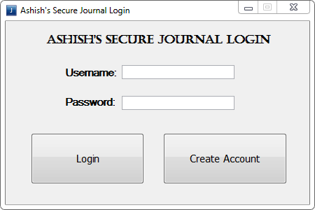
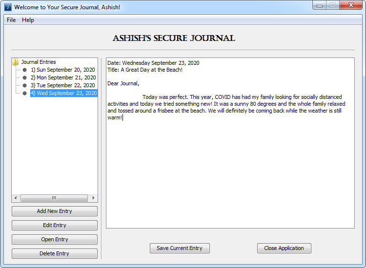
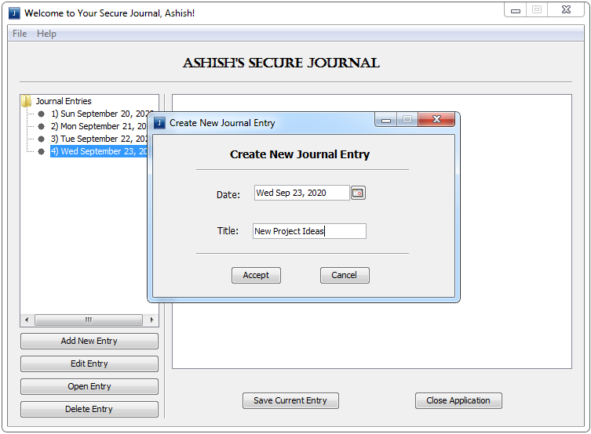

#  Secure Journal

Created by Ashish Ramachandran // Fall 2020

## Introduction

Secure Journal was made as a fun application for anyone who wants to password protect their journal entries! For anyone looking to develop better habits and start journaling, this app is made for you! 

## Features

The journal has functionality to save accounts locally to allow for personalized journals. Each user will have their saved journal entries sorted by date in the bar to the left containing all journal entries in an organized list. Users can be prompted to add new entries by providing a date and a title. This information can be edited later. Everything will be saved to the user's personalized, password protected account!

## Highlights While Building
- Understanding UI/UX to create an intuitive and clean application
- Learning how to save serializable files locally
- Organizing journal entries by date for a better experience

## Further Steps

This is a fairly straightforward implementation and further development could be made on security, UI and UX. It would be a fun project to add the functionality to save media within journal entries to make entries (and your experience) more memorable. This app could also be created in Swift and further iterated for users to journal on their iPhone.

## Media

